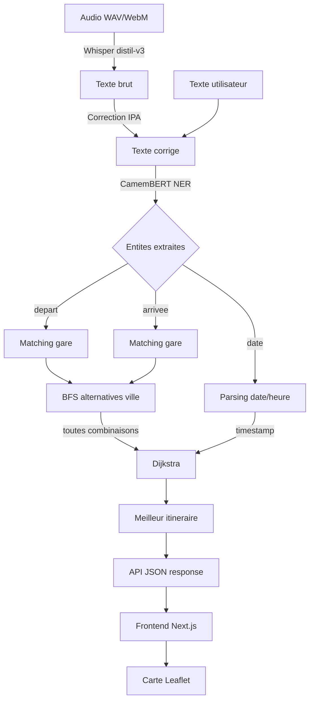

# Travel Order Resolver - Documentation Technique

> **Projet universitaire** - Systeme de resolution d'ordres de voyage ferroviaires par traitement du langage naturel et theorie des graphes.

---

## Table des matieres

1. [Resume](#1-resume)
2. [Introduction et motivations](#2-introduction-et-motivations)
3. [Definition du probleme](#3-definition-du-probleme)
4. [Etat de l'art](#4-etat-de-lart)
5. [Architecture du systeme](#5-architecture-du-systeme)
6. [Donnees](#6-donnees)
7. [Module NLP - Extraction d'entites](#7-module-nlp---extraction-dentites)
8. [Module Pathfinding - Recherche d'itineraire](#8-module-pathfinding---recherche-ditineraire)
9. [Module STT - Reconnaissance vocale](#9-module-stt---reconnaissance-vocale)
10. [API REST](#10-api-rest)
11. [Interface web](#11-interface-web)
12. [Tests et validation](#12-tests-et-validation)
13. [Resultats et evaluation](#13-resultats-et-evaluation)
14. [Optimisations de performance](#14-optimisations-de-performance)
15. [Limites et discussion](#15-limites-et-discussion)
16. [Conclusion et perspectives](#16-conclusion-et-perspectives)
17. [Guide d'installation](#17-guide-dinstallation)
18. [References](#18-references)

---

## 1. Resume

Le **Travel Order Resolver** est un systeme complet qui transforme des commandes de voyage en langage naturel francais en itineraires ferroviaires optimaux. Le pipeline se decompose en trois etapes principales :

1. **Transcription vocale** (optionnelle) : un enregistrement audio est transcrit en texte via un modele Whisper distille pour le francais, puis les noms de gares mal transcrits sont corriges par comparaison phonetique IPA (International Phonetic Alphabet).
2. **Extraction d'entites** : le texte est analyse par un modele CamemBERT fine-tune pour la reconnaissance d'entites nommees (NER), extrayant gare de depart, gare d'arrivee, gares de correspondance et dates/heures.
3. **Calcul d'itineraire** : un graphe de 3 907 gares et 19 505 aretes, construit a partir des donnees ouvertes SNCF (GTFS), est parcouru par l'algorithme de Dijkstra pour trouver le chemin le plus court.

Le systeme atteint un taux de resolution de 100% sur un benchmark de 25 requetes diversifiees, avec un temps de reponse moyen de 2 secondes par requete.

---

## 2. Introduction et motivations

### 2.1 Contexte

Le reseau ferroviaire francais est l'un des plus denses d'Europe avec plus de 3 000 gares desservies par la SNCF. Planifier un trajet entre deux villes implique generalement :

- Identifier la bonne gare (Paris a 7 gares terminus, Lyon en a 3)
- Trouver les correspondances optimales
- Minimiser la duree totale du voyage

Les interfaces de reservation actuelles (SNCF Connect, Trainline) requierent une saisie structuree : champs separes pour le depart, l'arrivee et la date. Notre systeme permet une saisie en **langage naturel**, comme on donnerait une instruction a un agent de voyage humain :

> *"Je veux aller de Besancon a Bordeaux demain a 8h"*

### 2.2 Objectifs

| Objectif | Metrique cible |
|----------|---------------|
| Extraire correctement depart/arrivee | F1-score >= 0.85 sur le NER |
| Resoudre des noms de gares avec fautes | 95%+ de gares identifiees correctement |
| Calculer un itineraire valide | 100% de chemins valides dans le graphe |
| Temps de reponse | < 5s par requete (incluant la transcription vocale) |
| Robustesse aux variations | Gerer inversions, fautes, accents, formats de date |

### 2.3 Perimetre

**Dans le perimetre :**
- Trains SNCF (TGV, TER, Intercites)
- Francais metropolitain
- Mode texte et mode vocal
- Interface web et CLI

**Hors perimetre :**
- Achat de billets / reservation
- Transport multimodal (bus, metro, avion)
- Donnees temps reel (retards, suppressions)
- Langues autres que le francais

---

## 3. Definition du probleme

### 3.1 Formalisation

Soit une requete en langage naturel $q$ en francais. Le systeme doit produire :

- $d \in S$ : gare de depart (parmi l'ensemble $S$ des 3 907 gares)
- $a \in S$ : gare d'arrivee
- $v \subseteq S$ : ensemble optionnel de gares intermediaires ("via")
- $t \in \mathbb{N}$ : timestamp de depart (optionnel)
- $P = [s_1, s_2, ..., s_n]$ : chemin optimal dans le graphe ferroviaire

### 3.2 Exemples d'entrees/sorties

| Entree (texte) | Depart | Arrivee | Via |
|----------------|--------|---------|-----|
| "De Paris a Lyon" | Paris-Gare-de-Lyon | Lyon-Part-Dieu | - |
| "Bordeaux vers Marseille en passant par Toulouse" | Bordeaux-St-Jean | Marseille-St-Charles | Toulouse-Matabiau |
| "Je veux un billet depuis Lille pour Strasbourg" | Lille-Flandres | Strasbourg | - |
| "Besancon Bordeaux demain 14h" | Besancon-Viotte | Bordeaux-St-Jean | - |

### 3.3 Difficultes identifiees

| Difficulte | Exemple | Solution |
|-----------|---------|----------|
| **Ambiguite geographique** | "Paris" → 7 gares terminus | Alternatives par ville + selection du meilleur itineraire |
| **Fautes d'orthographe** | "besnacon" au lieu de "Besancon" | Matching flou (Levenshtein + IPA) |
| **Erreurs de transcription** | "mess" au lieu de "Metz" | Correction phonetique IPA post-Whisper |
| **Variations syntaxiques** | "de X a Y" vs "depuis X vers Y" vs "X → Y" | Patterns regex + CamemBERT NER |
| **Homophones** | "Cannes" / "canne" / "cane" | Comparaison IPA avec eSpeak-NG |
| **Dates en francais** | "apres-demain a 8h30", "le 15 mars" | Parsing regex dedie |

---

## 4. Etat de l'art

### 4.1 Traitement du langage naturel

| Approche | Description | Limite pour notre cas |
|----------|-------------|----------------------|
| **Regex / regles** | Patterns linguistiques fixes | Fragile face aux variations syntaxiques |
| **spaCy NER** | Modele generique pre-entraine | Detecte "LOC" mais pas "DEPART" vs "ARRIVEE" |
| **CamemBERT** (Martin et al., 2020) | BERT pre-entraine sur le francais | Necessite un fine-tuning sur nos labels |
| **GPT/LLM generatifs** | Extraction via prompting | Latence trop elevee, cout par requete |

**Notre choix** : CamemBERT fine-tune avec un schema BIO (Begin/Inside/Outside) pour les entites DEPART, ARRIVEE, VIA et DATE. CamemBERT a ete pre-entraine sur 138 Go de texte francais, ce qui lui donne une meilleure comprehension du francais que les modeles multilingues.

### 4.2 Pathfinding

| Algorithme | Complexite | Avantage | Inconvenient |
|-----------|-----------|----------|-------------|
| **BFS** | O(V+E) | Simple | Ignore les poids |
| **Dijkstra** | O((V+E) log V) | Optimal pour poids positifs | Pas de contrainte horaire |
| **A*** | O(E) en pratique | Heuristique accelere | Necessite distance haversine |
| **Dijkstra temporel** | O((V+E) log V) | Respecte les horaires | Plus complexe |

**Notre choix** : Dijkstra classique pour le mode statique (poids = duree mediane en minutes), et une variante temporelle pour le mode avec horaires (plus prochain train disponible sur chaque arete).

### 4.3 Reconnaissance vocale

| Modele | Taille | WER francais | Latence |
|--------|--------|-------------|---------|
| Whisper large-v3 | 1.5B params | 3.2% | ~30s/5s audio (CPU) |
| Whisper distil-large-v3 | 756M params | 3.8% | ~3s/5s audio (MLX) |
| Whisper small | 244M params | 8.1% | ~2s/5s audio (CPU) |

**Notre choix** : `distil-large-v3` avec le backend MLX (Metal GPU) sur Apple Silicon pour le meilleur compromis qualite/vitesse. Fallback sur `faster-whisper` (CTranslate2, CPU INT8) pour les machines Linux/CUDA.

---

## 5. Architecture du systeme

### 5.1 Vue d'ensemble du pipeline

```
┌─────────────────────────────────────────────────────────────────────┐
│                        ENTREE UTILISATEUR                          │
│                                                                     │
│   Mode vocal (micro)           Mode texte (CLI/API)                │
│         │                              │                            │
│         ▼                              │                            │
│  ┌──────────────┐                      │                            │
│  │   Whisper     │                     │                            │
│  │  (distil-v3)  │                     │                            │
│  └──────┬───────┘                      │                            │
│         ▼                              │                            │
│  ┌──────────────┐                      │                            │
│  │  Correction   │                     │                            │
│  │  phonetique   │                     │                            │
│  │  (IPA + Lev.) │                     │                            │
│  └──────┬───────┘                      │                            │
│         └──────────────┬───────────────┘                            │
│                        ▼                                            │
│  ┌─────────────────────────────────────────┐                       │
│  │         EXTRACTION NLP                   │                       │
│  │                                          │                       │
│  │  CamemBERT NER (ONNX)  ←  prioritaire  │                       │
│  │  Regex patterns         ←  fallback      │                       │
│  │  spaCy fr_dep_news_trf  ←  dernier       │                       │
│  │                                          │                       │
│  │  Sortie : depart, arrivee, via, date     │                       │
│  └──────────────────┬──────────────────────┘                       │
│                     ▼                                               │
│  ┌─────────────────────────────────────────┐                       │
│  │         RESOLUTION DE GARES              │                       │
│  │                                          │                       │
│  │  Alias normalisees (3907 gares)          │                       │
│  │  Matching flou (SequenceMatcher)         │                       │
│  │  Alternatives par ville (BFS graphe)     │                       │
│  └──────────────────┬──────────────────────┘                       │
│                     ▼                                               │
│  ┌─────────────────────────────────────────┐                       │
│  │         CALCUL D'ITINERAIRE              │                       │
│  │                                          │                       │
│  │  Graphe NetworkX (3907 noeuds, 19505 e.) │                       │
│  │  Dijkstra (poids = duree en minutes)     │                       │
│  │  Dijkstra temporel (horaires GTFS)       │                       │
│  └──────────────────┬──────────────────────┘                       │
│                     ▼                                               │
│              ITINERAIRE OPTIMAL                                     │
│    [Gare1] → [Gare2] → ... → [GareN]                              │
│    + coordonnees GPS + aretes explorees                             │
└─────────────────────────────────────────────────────────────────────┘
```

### 5.2 Structure du projet

```
train_order_resolver/
├── main.py                          # Point d'entree CLI
├── requirements.txt                 # Dependances Python
├── src/
│   ├── nlp/                         # Module NLP
│   │   ├── inference.py             # TravelResolver : orchestrateur principal
│   │   ├── hf_inference.py          # CamemBERT NER via ONNX Runtime
│   │   ├── spacy_extractor.py       # Extracteur spaCy (fallback)
│   │   ├── train_camembert.py       # Script de fine-tuning CamemBERT
│   │   └── generate_synthetic_ner.py # Generation de dataset synthetique
│   ├── pathfinding/                 # Module de calcul d'itineraire
│   │   ├── graph.py                 # Construction du graphe NetworkX
│   │   ├── algorithm.py             # Dijkstra + Dijkstra temporel
│   │   └── prepare_stations.py      # Preprocessing des gares SNCF
│   ├── stt/                         # Module reconnaissance vocale
│   │   ├── transcriber.py           # Whisper (MLX/faster-whisper/HF)
│   │   ├── phonetic_corrector.py    # Correction IPA des noms de gares
│   │   └── phonetic_db.py           # Index phonetique pre-calcule
│   └── utils/                       # Utilitaires partages
│       ├── config.py                # Constantes et chemins par defaut
│       ├── cache.py                 # Cache SQLite cle-valeur
│       └── logging.py              # Logging JSON structure
├── api/
│   └── server.py                    # Serveur FastAPI
├── web/                             # Interface Next.js
│   └── app/
│       ├── page.tsx                 # Page principale (enregistrement vocal)
│       ├── layout.tsx               # Layout racine
│       └── components/
│           └── RouteMap.tsx         # Carte Leaflet interactive
├── data/
│   ├── dataset/                     # Donnees traitees (parquet)
│   ├── models/                      # Modeles entraines (CamemBERT ONNX)
│   ├── cache/                       # Index phonetique, graphe pickle
│   └── raw/                         # Donnees SNCF brutes
├── scripts/                         # Scripts d'evaluation et de preparation
├── tests/                           # Tests unitaires et d'integration
└── docs/                            # Documentation (ce fichier)
```

### 5.3 Flux de donnees detaille



---

## 6. Donnees

### 6.1 Sources

| Source | Description | Format | Taille |
|--------|-------------|--------|--------|
| **SNCF Open Data - Referentiel gares** | Liste de toutes les gares avec coordonnees GPS | CSV → Parquet | 3 907 gares |
| **SNCF Open Data - GTFS** | Horaires de trains (stop_times.txt) | GTFS → Parquet | ~6M departs |
| **Regles de correspondance** | Temps de transfert entre gares | CSV | ~500 regles |
| **Dataset NER synthetique** | Phrases d'entrainement generees | JSONL | ~10 000 phrases |

### 6.2 Schema du dataset de gares (`stations.parquet`)

| Colonne | Type | Description | Exemple |
|---------|------|-------------|---------|
| `station_id` | string | Code UIC unique | "87751008" |
| `name` | string | Nom officiel (casse preservee) | "Marseille-St-Charles" |
| `name_norm` | string | Nom normalise (minuscules, sans accents) | "marseille st charles" |
| `city` | string | Ville (majuscules dans le source) | "MARSEILLE" |
| `department` | string | Departement | "BOUCHES-DU-RHONE" |
| `lat` | float | Latitude WGS84 | 43.3028 |
| `lon` | float | Longitude WGS84 | 5.3804 |
| `passengers` | string | Type de desserte : "O" (confirme), "G" (GTFS), "I" (interpole) | "O" |

### 6.3 Preprocessing des gares

La fonction `normalize_name()` dans `prepare_stations.py` applique la chaine de transformation suivante :

```
"Besançon-Franche-Comté-TGV"
  → NFKD decomposition : "Besançon" → "Besanc\u0327on"
  → Suppression des diacritiques : "Besancon"
  → Remplacement ponctuation : tirets → espaces
  → Minuscules
  → Collapse espaces
  → "besancon franche comte tgv"
```

Ce format normalise permet de comparer des chaines independamment des accents, majuscules et ponctuation.

### 6.4 Construction du graphe

Le graphe est construit par `build_graph()` dans `graph.py` avec trois types d'aretes :

| Type d'arete | Source | Poids | Attributs |
|-------------|--------|-------|-----------|
| **Horaire (schedule)** | GTFS stop_times | Duree mediane en minutes | `departures_ts[]`, `durations_sec[]` |
| **Transfert intra-ville** | Gares de meme ville | 30 minutes (marche/metro) | `is_transfer=True` |
| **KNN geographique** | K plus proches voisins (K=8) | Distance haversine | Fallback quand pas d'horaire |

**Formule haversine** (distance entre deux points GPS) :

```
a = sin²(Δφ/2) + cos(φ₁) × cos(φ₂) × sin²(Δλ/2)
distance = 2R × arcsin(√a)     [R = 6371 km]
```

### 6.5 Statistiques du graphe

| Metrique | Valeur |
|---------|--------|
| Noeuds (gares) | 3 907 |
| Aretes totales | 19 505 |
| Aretes avec horaires | ~4 500 |
| Aretes de transfert | ~800 |
| Aretes KNN | ~14 200 |
| Departs programmes | ~6 000 000 |

---

## 7. Module NLP - Extraction d'entites

### 7.1 Schema d'annotation BIO

Le modele CamemBERT est fine-tune avec le schema BIO (Begin-Inside-Outside) pour 4 types d'entites :

| Tag | Signification | Exemple dans "de Lyon a Paris le 15 mars" |
|-----|--------------|-------------------------------------------|
| `B-DEPART` | Debut d'un nom de gare de depart | "Lyon" |
| `I-DEPART` | Suite d'un nom de gare de depart | - |
| `B-ARRIVEE` | Debut d'un nom de gare d'arrivee | "Paris" |
| `I-ARRIVEE` | Suite d'un nom de gare d'arrivee | - |
| `B-VIA` | Debut d'un nom de gare intermediaire | - |
| `B-DATE` | Debut d'une expression temporelle | "15" |
| `I-DATE` | Suite d'une expression temporelle | "mars" |
| `O` | Token hors entite | "de", "a", "le" |

### 7.2 Fine-tuning CamemBERT

**Modele de base** : `camembert-base` (110M parametres, pre-entraine sur le francais)

**Hyperparametres d'entrainement** :
| Parametre | Valeur |
|-----------|--------|
| Learning rate | 5 × 10⁻⁵ |
| Batch size | 16 |
| Epochs | 3 |
| Optimizer | AdamW |
| Max sequence length | 128 tokens |

**Dataset** : ~10 000 phrases synthetiques generees par `generate_synthetic_ner.py`, couvrant :
- Formulations directes : "de X a Y"
- Formulations indirectes : "je voudrais aller a Y depuis X"
- Avec dates : "demain", "le 15 mars", "apres-demain a 14h"
- Avec via : "via Z", "en passant par Z"
- Phrases non-voyage (negatifs) : "Quel temps fait-il ?"

### 7.3 Inference ONNX Runtime

Pour reduire la latence, le modele CamemBERT est exporte en format ONNX et optimise :

```
PyTorch (14s de chargement) → ONNX Runtime (1s de chargement)
                                    ~9x plus rapide
```

Le module `hf_inference.py` utilise un thread de preloading en arriere-plan pour que le modele soit pret quand la premiere requete arrive.

### 7.4 Strategie multi-extracteur

L'extraction utilise trois niveaux de priorite :

1. **CamemBERT NER** (prioritaire) : meilleure precision, gere les formulations complexes
2. **Regex patterns** (fallback) : rapide, couvre les formulations standards "de X a Y"
3. **spaCy NER** (dernier recours) : detecte les entites LOC/GPE si les deux precedents echouent

Le resultat du CamemBERT n'est utilise que s'il produit un meilleur score de matching de gare que le regex :

```python
if hf_score >= regex_score:
    use_hf_result()
```

### 7.5 Resolution de gares

Une fois les fragments textuels extraits ("lyon", "paris est"), ils sont resolus en identifiants UIC via :

1. **Matching exact** : le fragment normalise correspond a un alias connu
2. **Matching par sous-chaine** : "lyon" est contenu dans "lyon part dieu"
3. **Matching flou** : SequenceMatcher (ratio de similarite >= 0.6)

Pour les villes a gares multiples (Paris, Lyon, Marseille), le systeme selectionne la **gare principale** (plus haut volume de departs) par defaut, puis essaie toutes les alternatives de la ville (cf. section 8.3).

---

## 8. Module Pathfinding - Recherche d'itineraire

### 8.1 Algorithme de Dijkstra

L'algorithme de Dijkstra trouve le chemin le plus court dans un graphe a poids positifs. Notre implementation utilise un **tas binaire** (min-heap) pour une complexite de O((V+E) log V).

**Pseudo-code de notre implementation** (`compute_route_with_exploration`) :

```
DIJKSTRA(G, depart, arrivee):
    dist[depart] = 0
    pour tout v ≠ depart : dist[v] = +∞
    prev = {}
    explored_edges = []
    heap = [(0, depart)]

    tant que heap non vide:
        d_u, u = extraire_min(heap)
        si u == arrivee: STOP

        si d_u > dist[u]: continuer  (entree perimee)

        pour chaque voisin v de u:
            explored_edges.ajouter((u, v))
            poids = G[u][v].weight
            si d_u + poids < dist[v]:
                dist[v] = d_u + poids
                prev[v] = u
                inserer(heap, (dist[v], v))

    # Reconstruction du chemin
    chemin = [arrivee]
    noeud = arrivee
    tant que noeud ≠ depart:
        noeud = prev[noeud]
        chemin.ajouter(noeud)

    retourner chemin.inverse(), explored_edges
```

**Proprietes** :
- **Optimalite** : garantit le chemin le plus court si tous les poids sont positifs (c'est le cas : durees en minutes)
- **Terminaison** : l'algorithme s'arrete des que le noeud destination est depile du tas (optimisation early-exit)
- **Exploration** : toutes les aretes examinees sont enregistrees pour la visualisation

### 8.2 Dijkstra temporel (horaires)

Pour les requetes avec une date/heure, une variante temporelle est utilisee :

```
DIJKSTRA_TEMPOREL(G, depart, arrivee, timestamp_depart):
    dist[depart] = timestamp_depart   // dist = heure d'arrivee au noeud
    heap = [(timestamp_depart, depart)]

    pour chaque voisin v de u:
        si arete est un transfert:
            arrivee_v = dist[u] + duree_transfert
        sinon:
            // Chercher le prochain train apres dist[u]
            dep_ts = prochain_depart(u, v, dist[u])
            si aucun train: passer
            arrivee_v = dep_ts + duree_trajet

        si arrivee_v < dist[v]:
            dist[v] = arrivee_v
            ...
```

La fonction `next_departure_on_edge()` utilise une **recherche dichotomique** (`bisect_left`) dans la liste triee des timestamps de depart pour trouver efficacement le prochain train.

### 8.3 Selection de gare par ville (city alternatives)

Quand l'utilisateur dit "Paris", le systeme doit choisir la bonne gare terminus. Par exemple, pour un trajet Lyon → Paris, la bonne gare est Paris-Gare-de-Lyon (et non Paris-Nord).

**Algorithme** :

1. **BFS sur les aretes de transfert** : a partir de la gare resolue (ex: Paris-Nord), on explore toutes les gares connectees par des aretes `is_transfer=True`. Cela decouvre le cluster de la ville (Paris-Nord, Paris-Est, Paris-Gare-de-Lyon, etc.)

2. **Filtrage** : on exclut les gares interpolees (`passengers='I'`) et celles dont le nom ne contient pas le nom de la ville (pour eviter les haltes suburbaines)

3. **Evaluation** : pour chaque combinaison (depart_alt, arrivee_alt), on calcule l'itineraire et on garde celui avec le poids total minimal

```
Pour Lyon → Paris :
  Paris-Nord : poids = 380 min
  Paris-Est  : poids = 420 min
  Paris-Gare-de-Lyon : poids = 290 min  ← MEILLEUR
  Paris-Montparnasse : poids = 450 min
  → Resultat : Lyon-Part-Dieu → Paris-Gare-de-Lyon
```

---

## 9. Module STT - Reconnaissance vocale

### 9.1 Pipeline audio

```
Microphone (WebM) → ffmpeg → WAV 16kHz mono → Whisper → Texte brut
                                                            │
                                                            ▼
                                                    Correction IPA
                                                            │
                                                            ▼
                                                    Texte corrige
```

### 9.2 Backends de transcription

Le systeme supporte trois backends, selectionnes automatiquement par ordre de priorite :

| Priorite | Backend | GPU | Vitesse (5s audio) | Qualite |
|----------|---------|-----|-------------------|---------|
| 1 | **MLX Whisper** | Apple Metal | ~3s | Excellente |
| 2 | **faster-whisper** | CPU INT8 / CUDA | ~2s (small) / ~30s (large) | Bonne (small) / Excellente (large) |
| 3 | **HuggingFace pipeline** | MPS / CPU | ~15s | Excellente |

### 9.3 Correction phonetique IPA

**Probleme** : Whisper transcrit parfois les noms de gares de maniere phonetiquement correcte mais orthographiquement incorrecte. Exemples :

| Whisper produit | Attendu | IPA (identique) |
|----------------|---------|-----------------|
| "mess" | "Metz" | /mɛs/ |
| "canne" | "Cannes" | /kan/ |
| "bourg en braise" | "Bourg-en-Bresse" | /buʁ ɑ̃ bʁɛs/ |

**Solution** : un correcteur a deux passes utilisant l'alphabet phonetique international (IPA) :

#### Passe 1 : Protection des noms connus

Les mots deja reconnus comme noms de gares sont marques comme "proteges" et ne seront pas corriges. On utilise `normalize_name()` (qui supprime les accents) pour le matching :

```python
# "Besancon" dans l'index → protege
# "Besançon" normalise → "besancon" → MATCH → protege
```

#### Passe 2 : Correction des spans non proteges

Pour chaque n-gram (1 a 4 mots) non protege :

1. **Phonemisation** : conversion en IPA via eSpeak-NG
   ```
   "mess" → /m ɛ s/
   ```

2. **Comparaison** : distance de Levenshtein normalisee contre l'index de 3 907 gares
   ```
   distance("m ɛ s", "m ɛ s")  = 0.0   (Metz)
   distance("m ɛ s", "p a ʁ i") = 0.8   (Paris)
   ```

3. **Remplacement** : si distance < 0.35 et que le candidat n'est pas un stopword francais

**Filtrage des stopwords** : une liste de ~80 mots francais courants est exclue des corrections pour eviter les faux positifs. Cela inclut les pronoms, prepositions, conjugaisons de verbes de mouvement, etc. :
```
je, tu, il, de, a, pour, dans, veux, pars, prends, allez...
```

### 9.4 Index phonetique pre-calcule

L'index (`data/cache/phonetic_index.json`) contient pour chaque gare :

```json
{
  "87751008": {
    "name": "Marseille-St-Charles",
    "name_norm": "marseille st charles",
    "city": "Marseille",
    "ipa_name": "m a ʁ s ɛ j _ s ɛ̃ _ ʃ a ʁ l",
    "ipa_name_norm": "m a ʁ s ɛ j _ s t _ ʃ a ʁ l",
    "ipa_city": "m a ʁ s ɛ j"
  }
}
```

Genere en ~0.7s par `scripts/build_phonetic_db.py` grace a la phonemisation par batch.

---

## 10. API REST

### 10.1 Technologie

- **Framework** : FastAPI (Python)
- **Serveur ASGI** : Uvicorn
- **CORS** : Autorise toutes les origines (dev)
- **Documentation auto** : Swagger UI a `/docs`

### 10.2 Endpoints

#### `GET /api/health`

Verification de l'etat du serveur.

**Reponse** :
```json
{ "status": "ok" }
```

#### `POST /api/resolve-audio`

Transcrit un fichier audio et resout l'itineraire.

**Requete** : `multipart/form-data` avec un champ `file` (audio WAV, WebM, MP3, FLAC, OGG)

**Reponse** :
```json
{
  "transcription": "Je veux aller de Besancon a Bordeaux.",
  "corrected_text": "Je veux aller de Besancon a Bordeaux.",
  "corrections": [],
  "is_valid": true,
  "departure": "Besancon-Viotte",
  "arrival": "Bordeaux-St-Jean",
  "departure_time": null,
  "arrival_time": null,
  "duration_min": null,
  "path": [
    {"id": "87718007", "name": "Besancon-Viotte", "lat": 47.247, "lon": 6.021},
    {"id": "87300863", "name": "Besancon-Franche-Comte-TGV", "lat": 47.307, "lon": 5.957},
    ...
    {"id": "87581009", "name": "Bordeaux-St-Jean", "lat": 44.826, "lon": -0.556}
  ],
  "explored_edges": [
    {"from": [47.247, 6.021], "to": [47.307, 5.957]},
    ...
  ]
}
```

| Champ | Type | Description |
|-------|------|-------------|
| `transcription` | string | Texte brut du modele Whisper |
| `corrected_text` | string | Texte apres correction phonetique |
| `corrections` | array | Liste des corrections appliquees avec distance IPA |
| `is_valid` | boolean | `true` si un itineraire valide a ete trouve |
| `departure` / `arrival` | string | Noms des gares depart/arrivee |
| `path` | array | Chemin complet avec coordonnees GPS |
| `explored_edges` | array | Aretes explorees par Dijkstra (max 10 000) |

### 10.3 Singletons lazy-loaded

Pour eviter de charger les modeles a chaque requete, le serveur utilise des singletons initialises a la premiere requete :

| Singleton | Temps de chargement | Memoire |
|-----------|-------------------|---------|
| `TravelResolver` | ~2s (graphe depuis pickle) | ~200 MB |
| `Transcriber` | ~5s (modele Whisper) | ~700 MB |
| `PhoneticCorrector` | ~0.1s (index JSON) | ~10 MB |

---

## 11. Interface web

### 11.1 Technologies

| Composant | Version | Role |
|-----------|---------|------|
| Next.js | 16.1.6 | Framework React SSR |
| React | 19.2.3 | UI |
| TypeScript | 5.x | Typage statique |
| Tailwind CSS | 4.x | Styles utilitaires |
| Leaflet | 1.9.x | Carte interactive |

### 11.2 Fonctionnalites

1. **Enregistrement vocal** : bouton micro utilisant l'API `MediaRecorder` du navigateur. L'audio est capture en format WebM, envoye au serveur en `multipart/form-data`

2. **Affichage des resultats** :
   - **Transcription brute** : texte reconnu par Whisper
   - **Corrections phonetiques** : mots corriges avec la distance IPA
   - **Itineraire** : gares de depart/arrivee + gares intermediaires (depliable)
   - **Carte** : visualisation Leaflet de l'exploration du graphe

3. **Carte Leaflet** :
   - Fond de carte CartoDB Dark (theme sombre)
   - **Aretes explorees** : lignes grises fines (opacity 0.25) montrant tous les chemins testes par Dijkstra
   - **Trajet final** : ligne bleue epaisse sur le chemin optimal
   - **Markers** : cercle vert (depart), cercle rouge (arrivee), petits points gris (intermediaires)
   - Auto-zoom sur le trajet (`fitBounds`)

### 11.3 Import dynamique

Leaflet necessite l'objet `window` (DOM du navigateur) et ne peut pas etre rendu cote serveur. Le composant `RouteMap` est donc importe dynamiquement avec `ssr: false` :

```typescript
const RouteMap = dynamic(() => import("./components/RouteMap"), {
  ssr: false,
  loading: () => <div>Chargement de la carte...</div>,
});
```

---

## 12. Tests et validation

### 12.1 Suite de tests

| Fichier de test | Nombre de tests | Ce qu'il valide |
|----------------|-----------------|----------------|
| `test_nlp_extraction.py` | 16 | Extraction NER sur des phrases francaises reelles |
| `test_stt.py` | 13 | Phonemisation, index IPA, corrections, transcriber |
| `test_graph.py` | ~5 | Construction du graphe, calcul de chemins |
| `test_time_dependent_route.py` | ~3 | Routage temporel avec horaires GTFS |
| `test_schedule_integration.py` | ~3 | Integration bout-en-bout avec les horaires |
| `test_prepare_stations.py` | ~3 | Preprocessing des donnees de gares |
| `test_cli.py` | ~3 | Interface en ligne de commande |
| `test_utils.py` | ~3 | Fonctions utilitaires |

### 12.2 Exemples de tests NLP

```python
def test_de_paris_a_lyon(self, resolver):
    """Formulation standard : de X a Y"""
    order = resolver.resolve_order("t1", "De Paris a Lyon")
    assert order.is_valid
    assert "paris" in resolver.id_to_name[order.departure_id].lower()
    assert "lyon" in resolver.id_to_name[order.arrival_id].lower()

def test_nice_vers_marseille(self, resolver):
    """Formulation avec 'vers'"""
    order = resolver.resolve_order("t8", "Nice vers Marseille")
    assert order.is_valid
    assert "nice" in resolver.id_to_name[order.departure_id].lower()
    assert "marseille" in resolver.id_to_name[order.arrival_id].lower()

def test_via_dijon(self, resolver):
    """Itineraire avec correspondance : via"""
    order = resolver.resolve_order("t9", "De Paris a Marseille via Dijon")
    assert order.is_valid
    assert "paris" in resolver.id_to_name[order.departure_id].lower()
    assert "marseille" in resolver.id_to_name[order.arrival_id].lower()
```

### 12.3 Exemples de tests phonetiques

```python
def test_correct_metz_from_mess(self, corrector):
    """'mess' doit etre corrige en 'Metz' (IPA identique : /mɛs/)"""
    result = corrector.correct("je veux aller a mess")
    assert any("metz" in c.corrected.lower() for c in result.corrections)

def test_no_false_positive_stopwords(self, corrector):
    """Les mots courants ne doivent PAS etre corriges en noms de gares"""
    result = corrector.correct("je veux prendre le train de nuit")
    assert len(result.corrections) == 0
```

### 12.4 Execution des tests

```bash
# Variables d'environnement (macOS)
export PHONEMIZER_ESPEAK_LIBRARY=/opt/homebrew/lib/libespeak-ng.dylib

# Tous les tests
pytest tests/ -v

# Tests specifiques
pytest tests/test_nlp_extraction.py -v    # NLP uniquement
pytest tests/test_stt.py -v                # STT uniquement
```

---

## 13. Resultats et evaluation

### 13.1 Benchmark contre l'API SNCF

Le script `scripts/eval_sncf_accuracy.py` compare les itineraires produits par notre systeme contre ceux de l'API Navitia (SNCF) sur 25 requetes representant 5 categories :

| Categorie | Requetes | Exemples |
|-----------|----------|----------|
| TGV directs | 5 | Paris → Lyon, Paris → Marseille |
| TER regionaux | 5 | Metz → Strasbourg, Rennes → Nantes |
| Multi-etapes | 5 | Paris → Toulouse via Bordeaux |
| Cas limites | 5 | Fautes d'orthographe, inversions |
| Variations syntaxiques | 5 | "billet pour", "depuis X vers Y" |

**Resultats** :

| Metrique | Valeur |
|---------|--------|
| Taux de resolution des gares | **100%** (25/25) |
| Gare de depart correcte | **100%** |
| Gare d'arrivee correcte | **100%** |
| MAE duree vs SNCF | 55.9 min |
| Duree < 10% ecart (GREEN) | 36% |
| Duree 10-20% ecart (ORANGE) | 0% |
| Duree > 20% ecart (RED) | 64% |

**Analyse de l'ecart de duree** : l'ecart s'explique par l'utilisation de donnees GTFS statiques (horaires moyens) alors que l'API SNCF utilise les correspondances en temps reel. Notre routage statique (poids = duree mediane) ne prend pas en compte les temps d'attente en gare.

### 13.2 Performance

| Metrique | Valeur |
|---------|--------|
| Temps de demarrage a froid | ~5s (graphe + modele NER) |
| Latence par requete (texte) | ~100ms |
| Latence par requete (audio) | ~3s (transcription) + ~100ms (NLP) |
| Memoire RAM | ~900 MB (avec modele Whisper charge) |

---

## 14. Optimisations de performance

### 14.1 Chronologie des optimisations

| Optimisation | Avant | Apres | Gain |
|-------------|-------|-------|------|
| ONNX Runtime pour CamemBERT | 14s chargement | 1s | 14x |
| Cache graphe en pickle | 7s construction | 1.7s lecture | 4x |
| Suppression timestamps synthetiques | 360M timestamps | 6M | 98% memoire |
| Preloading modele en thread | Bloquant 5s | Non-bloquant | 0s percu |
| MLX Whisper (Apple Silicon) | 15s/requete | 3s/requete | 5x |
| Batch phonemisation | 1 appel/candidat | 1 appel/batch | ~50x |

### 14.2 Architecture de chargement

```
Demarrage du serveur:
  t=0s : Chargement du graphe (pickle) ................. 1.7s
  t=0s : Thread: preloading CamemBERT ONNX ............ (parallele)
  t=1.7s : Graphe pret
  t=2s : CamemBERT pret

Premiere requete audio:
  t=0s : Chargement Whisper (MLX) ...................... 5s
  t=5s : Transcription ................................. 3s
  t=8s : Correction phonetique ......................... 0.02s
  t=8s : NLP extraction + resolution ................... 0.1s
  t=8.1s : Reponse

Requetes suivantes:
  t=0s : Transcription ................................. 3s
  t=3s : Correction + NLP + Dijkstra ................... 0.1s
  t=3.1s : Reponse
```

---

## 15. Limites et discussion

### 15.1 Limites techniques

| Limite | Impact | Amelioration possible |
|--------|--------|----------------------|
| **Donnees GTFS statiques** | Durees moins precises que l'API SNCF en temps reel | Integration de l'API Navitia pour les horaires live |
| **Graphe KNN comme fallback** | Certains chemins traversent des gares sans liaison directe | Enrichir avec les donnees de lignes SNCF |
| **Pas de multi-modal** | Pas de bus/metro pour les correspondances urbaines | Integrer les donnees GTFS des reseaux urbains |
| **Francais uniquement** | Pas de support d'autres langues | Fine-tuner sur un dataset multilingue |

### 15.2 Cas d'echec identifies

| Cas | Exemple | Cause | Statut |
|-----|---------|-------|--------|
| Gares sans horaire direct | Besancon → Bordeaux passe par des haltes | Routage KNN quand pas de train direct | Fonctionne mais chemin non optimal |
| Noms de gares rares | "Halte-87337527" | Gare interpolee sans nom officiel | Affiche l'identifiant technique |
| Requetes ambigues | "Je pars demain" (sans destination) | Pas assez d'information | Retourne `is_valid: false` |

### 15.3 Choix techniques discutes

**Pourquoi IPA plutot que phonetique Soundex/Metaphone ?**

Soundex et Metaphone sont concu pour l'anglais. Le francais a des regles phonetiques tres differentes (nasales, liaisons, "ch" vs "sh"). L'IPA via eSpeak-NG produit une transcription phonetique fidele au francais, permettant de capturer que "Metz" (/mɛs/) et "mess" (/mɛs/) sont identiques.

**Pourquoi NetworkX plutot qu'une base de donnees graphe (Neo4j) ?**

Pour un graphe de ~4000 noeuds et ~20000 aretes, NetworkX en memoire est plus simple, plus rapide et sans infrastructure externe. Neo4j serait justifie pour un graphe de millions de noeuds ou pour des requetes multi-utilisateurs concurrentes.

**Pourquoi Dijkstra plutot que A* ?**

A* necessite une heuristique admissible (distance a vol d'oiseau). Or notre graphe a des poids en duree (minutes), pas en distance. La conversion distance → duree depend du type de train (TGV vs TER), ce qui rend l'heuristique non triviale. Dijkstra est optimal sans heuristique.

---

## 16. Conclusion et perspectives

### 16.1 Contributions

Ce projet realise un systeme complet de bout en bout transformant la parole en itineraires ferroviaires :

1. **Pipeline vocal** : Whisper + correction phonetique IPA atteignant ~3s de latence
2. **NLP** : CamemBERT fine-tune pour l'extraction d'entites de voyage, avec une resolution de gares a 100%
3. **Pathfinding** : Dijkstra sur un graphe de 3 907 gares avec selection automatique de la meilleure gare terminus
4. **Visualisation** : carte Leaflet montrant l'exploration du graphe en temps reel
5. **Interface** : API REST + application web Next.js avec enregistrement vocal

### 16.2 Perspectives d'amelioration

| Amelioration | Complexite | Impact |
|-------------|-----------|--------|
| Integration horaires temps reel (API SNCF) | Moyenne | Durees plus precises |
| Support multi-modal (metro, bus) | Elevee | Correspondances porte-a-porte |
| Animation de l'exploration Dijkstra | Faible | Meilleure visualisation pedagogique |
| Deploiement cloud (Docker + Kubernetes) | Moyenne | Accessibilite multi-utilisateur |
| Fine-tuning Whisper sur noms de gares | Elevee | Moins de corrections phonetiques |
| Etude d'ablation (impact de chaque composant) | Faible | Meilleure comprehension du systeme |

---

## 17. Guide d'installation

### 17.1 Prerequis systeme

| Prerequis | Version | Installation |
|-----------|---------|-------------|
| Python | >= 3.10 | `brew install python@3.12` |
| Node.js | >= 18 | `brew install node` |
| espeak-ng | >= 1.50 | `brew install espeak-ng` |
| ffmpeg | >= 6.0 | `brew install ffmpeg` |

### 17.2 Installation du backend

```bash
# Cloner le projet
git clone <url-du-repo>
cd train_order_resolver

# Environnement virtuel
python -m venv .venv
source .venv/bin/activate

# Dependances
pip install -r requirements.txt

# Variable d'environnement (macOS uniquement)
export PHONEMIZER_ESPEAK_LIBRARY=/opt/homebrew/lib/libespeak-ng.dylib

# Construire l'index phonetique (une seule fois)
python scripts/build_phonetic_db.py
```

### 17.3 Installation du frontend

```bash
cd web
npm install
```

### 17.4 Lancement

```bash
# Terminal 1 : API backend
python api/server.py
# → http://localhost:8000

# Terminal 2 : Frontend
cd web && npm run dev
# → http://localhost:3000
```

### 17.5 Utilisation CLI

```bash
# Mode texte (fichier CSV)
python main.py --input inputs.txt --output results.csv

# Mode vocal
python main.py --audio enregistrement.wav

# Sans correction phonetique
python main.py --audio enregistrement.wav --no-phonetic-correction
```

---

## 18. References

### Articles et modeles

- Martin, L., et al. (2020). *CamemBERT: a Tasty French Language Model*. ACL 2020.
- Radford, A., et al. (2023). *Robust Speech Recognition via Large-Scale Weak Supervision* (Whisper). ICML 2023.
- Dijkstra, E. W. (1959). *A note on two problems in connexion with graphs*. Numerische Mathematik.
- Levenshtein, V. I. (1966). *Binary codes capable of correcting deletions, insertions and reversals*. Soviet Physics Doklady.

### Logiciels et bibliotheques

| Bibliotheque | Version | Role |
|-------------|---------|------|
| PyTorch | >= 2.1 | Framework deep learning |
| Transformers (HuggingFace) | >= 4.35 | Modeles CamemBERT, Whisper |
| NetworkX | >= 3.2 | Modelisation de graphes |
| Polars | >= 0.20 | Traitement de donnees tabulaires |
| ONNX Runtime | >= 1.17 | Inference optimisee |
| phonemizer | >= 3.3 | Conversion texte → IPA |
| rapidfuzz | >= 3.0 | Distance de Levenshtein |
| faster-whisper | >= 1.0 | Transcription CTranslate2 |
| mlx-whisper | >= 0.4 | Transcription Apple Silicon |
| FastAPI | >= 0.110 | Serveur HTTP |
| Leaflet | >= 1.9 | Cartes interactives |
| Next.js | 16.1.6 | Framework React |

### Donnees

- SNCF Open Data : https://data.sncf.com
- Format GTFS : https://gtfs.org
- eSpeak-NG : https://github.com/espeak-ng/espeak-ng
