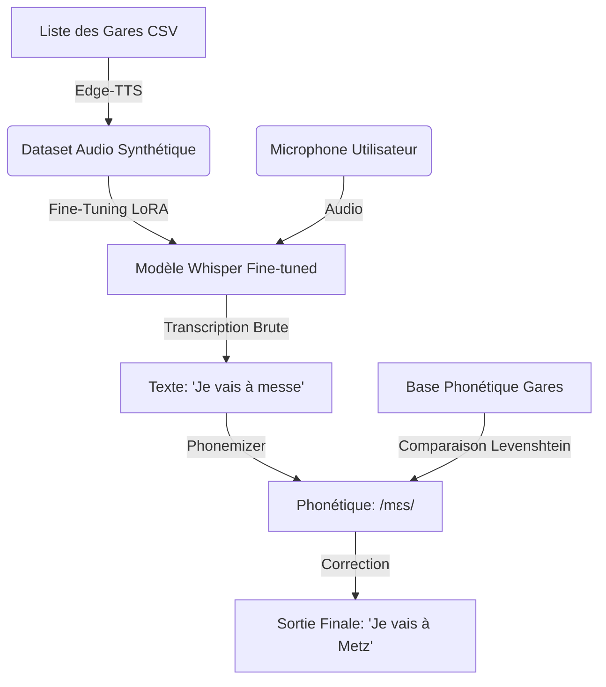

Voici la documentation complète et structurée de ta stratégie **Speech-to-Text (STT)**. Elle est divisée en deux parties : le **PRD (Product Requirement Document)** pour la vision produit/stratégique, et le **README technique** pour l'implémentation.

---

# PARTIE 1 : PRODUCT REQUIREMENT DOCUMENT (PRD)

**Titre du Projet :** Module SNCF Voice Recognition (STT-SNCF)
**Version :** 1.0
**Statut :** En développement
**Cible :** Module d'entrée vocale pour "Travel Order Resolver"

## 1. Contexte et Objectifs
Le système actuel "Travel Order Resolver" traite efficacement les commandes textuelles. Cependant, l'ajout d'une interface vocale présente un défi majeur : la reconnaissance précise des toponymes (noms de villes et gares) français, dont la prononciation est souvent irrégulière (ex: *Metz, Brotteaux, Plouaret*). Les modèles génériques échouent fréquemment sur ces entités nommées spécifiques.

**Objectif Principal :** Fournir un module de transcription capable de reconnaître 99% des noms de gares françaises, même avec des accents variés ou du bruit de fond.

## 2. Définition du Problème (Pain Points)
*   **Hallucinations des Modèles :** Un modèle standard transcrit "Bourg-en-Bresse" par "bourre en braise" ou "Montparnasse" par "mon parnass".
*   **Manque de Données Audio :** Nous possédons la liste textuelle des gares, mais aucun enregistrement audio (dataset) pour l'entraînement.
*   **Ambiguïté Phonétique :** Plusieurs villes peuvent se prononcer de manière similaire (homophonie).

## 3. Solution Proposée : Architecture Hybride
Nous adoptons une stratégie "Ceinture et Bretelles" (Double Sécurité) :

1.  **Entraînement Spécialisé (Fine-tuning) :** Adaptation du modèle SOTA **OpenAI Whisper** via l'apprentissage sur des données synthétiques. Le modèle apprendra le "vocabulaire SNCF".
2.  **Post-Traitement Phonétique (Safety Net) :** Un algorithme de correction qui compare la phonétique de la transcription avec la base de données officielle des gares pour corriger les erreurs résiduelles.

## 4. Spécifications Fonctionnelles

### 4.1. Génération de Données (Data Engineering)
*   Le système doit générer automatiquement un dataset audio à partir du fichier CSV des gares.
*   Utilisation de moteurs TTS (Text-to-Speech) neuronaux pour varier les voix (Homme/Femme) et les intonations.
*   Injection de phrases contextuelles (ex: *"Je pars de..."*, *"Arrivée à..."*) pour ne pas entraîner le modèle uniquement sur des mots isolés.

### 4.2. Modèle ASR (Acoustic Model)
*   **Base :** `openai/whisper-small` (Multilingue).
*   **Méthode d'entraînement :** LoRA (Low-Rank Adaptation) pour une efficacité computationnelle.
*   **Output :** Texte brut transcrit.

### 4.3. Correcteur Intelligent (Post-Processing)
*   Conversion du texte transcrit en **API (Alphabet Phonétique International)** via `eSpeak-NG`.
*   Comparaison floue (Fuzzy Matching / Levenshtein) avec les signatures phonétiques pré-calculées des gares.
*   Remplacement automatique par le nom de gare canonique si le score de similarité dépasse le seuil défini (ex: 85%).

## 5. Indicateurs de Succès (KPIs)
*   **WER (Word Error Rate) global :** < 5%.
*   **NER (Named Entity Recognition) sur les gares :** > 95% de précision.
*   **Latence :** < 2 secondes pour une phrase de 5 secondes sur GPU standard.

---

# PARTIE 2 : README TECHNIQUE (Implementation Strategy)

# SNCF Voice Recognition Module


Ce dépôt contient la pipeline complète de reconnaissance vocale spécialisée pour les gares ferroviaires françaises. Il combine un fine-tuning de modèle Transformer et une correction algorithmique basée sur la phonétique.

## Architecture Pipeline



## 1. Préparation des Données (Data Augmentation)

Comme nous ne disposons pas d'enregistrements réels, nous générons un dataset synthétique.

**Script :** `src/data_gen/generate_audio.py`
**Technologie :** `edge-tts` (Voix neuronales Microsoft Azure gratuites via Python).

```bash
# Génère ~10h d'audio avec des phrases contextuelles
python src/data_gen/generate_audio.py --input gares.csv --output dataset_audio/
```

*Le script génère également un fichier `metadata.csv` liant le fichier audio à la phrase textuelle.*

## 2. Entraînement (Fine-tuning LoRA)

Nous utilisons PEFT (Parameter-Efficient Fine-Tuning) pour adapter Whisper sans réentraîner tous les poids.

**Prérequis :** GPU avec min. 6GB VRAM (ex: RTX 3060, T4, P100).
**Script :** `src/train/fine_tune.py`

```python
# Extrait de la configuration LoRA
config = LoraConfig(
    r=32, 
    lora_alpha=64, 
    target_modules=["q_proj", "v_proj"], 
    lora_dropout=0.05, 
    bias="none"
)
```

**Commande :**
```bash
python src/train/fine_tune.py --model "openai/whisper-small" --dataset "dataset_audio/" --epochs 3
```

## 3. Inférence et Correction Phonétique

C'est le cœur de la robustesse du système. Même si le modèle fait une faute d'orthographe, la phonétique permet de retrouver la bonne gare.

**Script :** `src/inference/predict.py`
**Dépendances :** `phonemizer`, `espeak-ng`, `Levenshtein`.

### Logique du Correcteur :

```python
def semantic_correction(raw_text, stations_db):
    # 1. Phonémisation de l'entrée (ex: "Borme les mimosas")
    input_phon = phonemize(raw_text, language='fr-fr', backend='espeak', strip=True)
    
    best_match = raw_text
    lowest_distance = 5 # Seuil de tolérance
    
    # 2. Recherche dans la base pré-calculée
    for station_name, station_phon in stations_db.items():
        dist = Levenshtein.distance(input_phon, station_phon)
        
        if dist < lowest_distance:
            lowest_distance = dist
            best_match = station_name
            
    return best_match
```

## Utilisation

Charger le modèle et transcrire un fichier audio :

```bash
python main_stt.py --audio "mon_voyage.mp3" --correct-phonetics
```

**Exemple de sortie console :**
```text
> Loading LoRA Adapter... OK
> Transcribing...
> Raw Output: "Je voudrais un billet pour canne s'il vous plait"
> Phonetic Analysis: /kan/ detected.
> Fuzzy Match: Found "Cannes" (Distance: 0)
> Final Output: "Je voudrais un billet pour Cannes s'il vous plait"
```

## Installation

```bash
# 1. Système (Linux)
sudo apt-get install espeak-ng ffmpeg

# 2. Python
pip install -r requirements.txt
# (Contient: transformers, peft, accelerate, bitsandbytes, edge-tts, phonemizer, python-Levenshtein)
```